# Legere coetus chartam

Translated from Latin as _read the paper group_. On a weekly basis our science team reads and reviews anything from [_Challenges
design choices for global weather and climate models based on machine learning_](https://www.geosci-model-dev.net/11/3999/2018/)
to [DiffEqFlux.jl - A Julia Library for Neural Differential Equations
.](https://arxiv.org/abs/1902.02376) See planned [future discussions](https://github.com/Cervest/legere-coetus-chartam#planned-discussions) below.

#### February 16, 2021

- **Paper**: [A review of drought concepts](https://www.sciencedirect.com/science/article/pii/S0022169410004257)

- **Authors**: [Ashok K. Mishra](https://wpcarey.asu.edu/people/profile/2705118) and 
               [Vijay P. Singh](https://baen.tamu.edu/people/singh-vijay/).

- **Presenter**: Owen van Eer

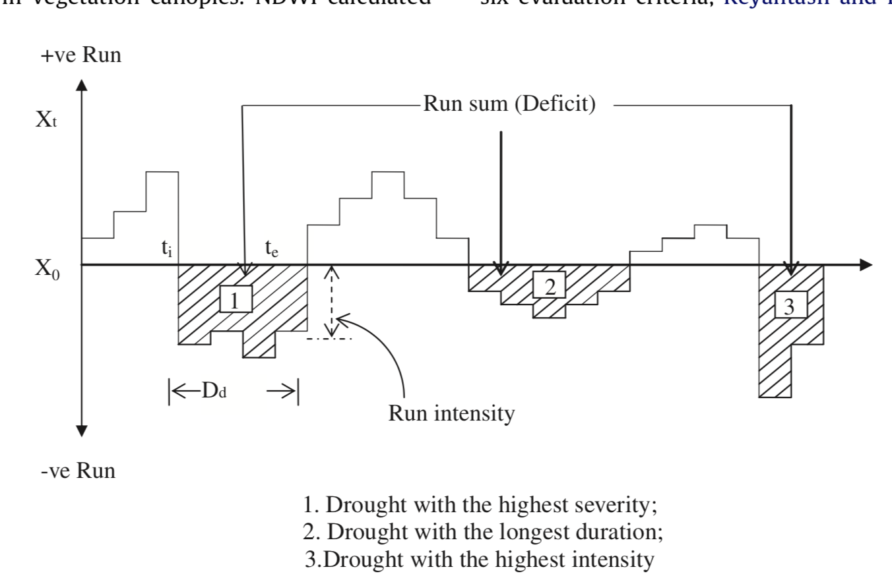

#### February 2, 2021

- **Paper**: [The use of the multi-model ensemble in probabilistic climate projections](The use of the multi-model ensemble in probabilistic climate projections)

- **Authors**: [Claudia Tebaldi](https://www.climatecentral.org/what-we-do/people/claudia_tebaldi) and 
               [Reto Knutti](https://iac.ethz.ch/people-iac/person-detail.html?persid=146272).

- **Presenter**: Laura Zamboni

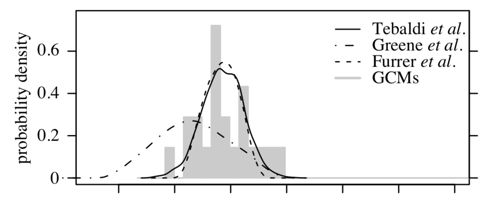

#### December 11, 2020

- **Paper**: [Downscaling probability of long heatwaves based on seasonal mean daily maximum temperatures](https://ascmo.copernicus.org/articles/4/37/2018/)

- **Authors**: [Rasmus E. Benestad](https://www.emetsoc.org/people/person/rasmus-benestad/), Bob van Oort, Flavio Justino, Frode Stordal, Kajsa M. Parding, Abdelkader Mezghani, Helene B. Erlandsen, Jana Sillmann, and Milton E. Pereira-Flores.

- **Presenter**: Ramani Lachyan and Lukas Scholtes

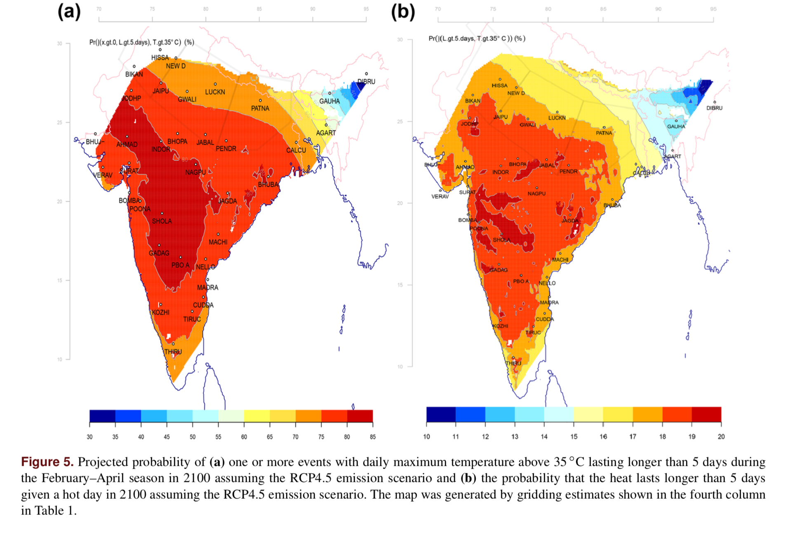

#### November 24, 2020

- **Paper**: [Flood frequency hydrology: 3. A Bayesian analysis](https://agupubs.onlinelibrary.wiley.com/doi/pdf/10.1029/2011WR010782)

- **Authors**: [Alberto Viglione](http://www.waterresources.at/index.php?id=117), 
               [Ralf Merz](https://www.ufz.de/index.php?en=40202), 
               [José Luis Salinas](http://www.waterresources.at/index.php?id=75), and 
               [Günter Blöschl](https://en.wikipedia.org/wiki/G%C3%BCnter_Bl%C3%B6schl).

- **Presenter**: Maxime Rischard

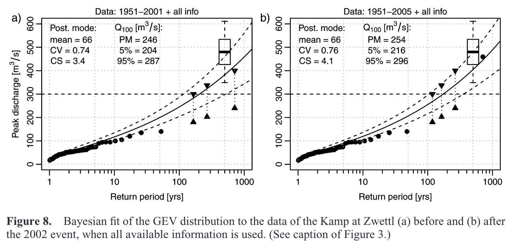

#### Novemver 11, 2020

**Paper**: [Quantifying CO2 emissions from individual power plants from space](https://agupubs.onlinelibrary.wiley.com/doi/pdf/10.1002/2017GL074702)

**Authors**: [Ray Nassar],
             [Timothy G. Hill],
             [Chris A. McLinden],
             [Debra Wunch],
             [Dylan B.A. Jones],
             [David Crisp]

**Paper**: [Estimating power plant CO2 emission using OCO-2 XCO2 and high resolution WRF-Chem simulations](https://iopscience.iop.org/article/10.1088/1748-9326/ab25ae/pdf)

**Authors**: [Zheng Tao],
             [Ray Nassar],
             [Martin Baxter]
             
**Presenter**: Maxim Chernetskiy      

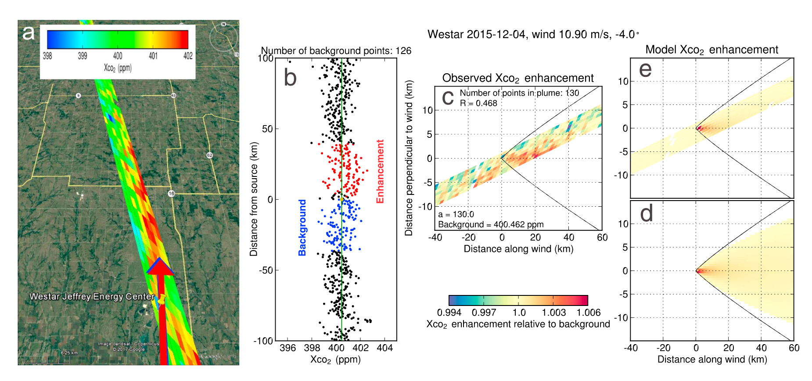

#### November 3, 2020

- **Paper**: [La Plata basin precipitation variability in spring: role of remote SST forcing as simulated by GCM experiments](https://link.springer.com/article/10.1007/s00382-013-1768-y)

- **Authors**: [Annalisa Cherchi](https://www.researchgate.net/profile/Annalisa_Cherchi), [Andrea F. Carril](https://scholar.google.com/citations?user=9qpEAJoAAAAJ), [Claudio G. Menéndez](http://www-atmo.at.fcen.uba.ar/cv/menendez.pdf), and [Laura Zamboni](https://www.mcs.anl.gov/~lzamboni/)

- **Presenter**: [Laura Zamboni](https://www.mcs.anl.gov/~lzamboni/)

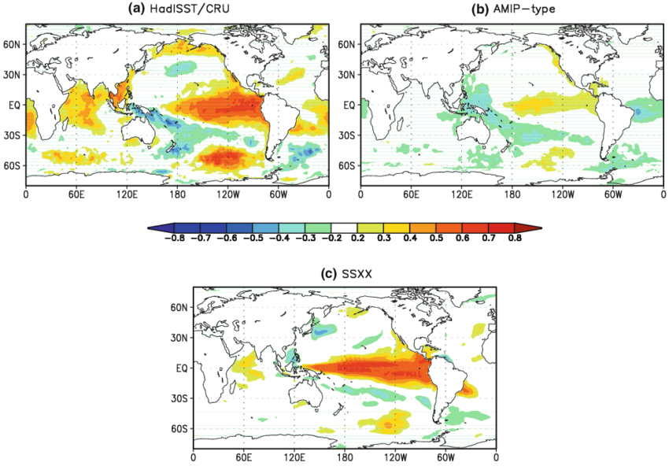

#### October 20, 2020

- **Paper**: [Trend analysis of climate time series: A review of methods](https://www.sciencedirect.com/science/article/pii/S0012825218303726)

- **Authors**: [Manfred Mudelsee](https://www.manfredmudelsee.com/) 

- **Presenter**: [Lukas Scholtes](https://www.linkedin.com/in/lukas-scholtes-ab40a4138/)

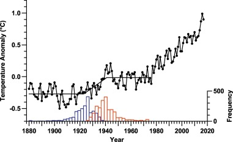

#### September 29, 2020

- **Paper**: [Continuous Spatial Process Models for Spatial Extreme Values](http://citeseerx.ist.psu.edu/viewdoc/download?doi=10.1.1.721.1748&rep=rep1&type=pdf)

- **Authors**: [Huiyan Sang](https://www.stat.tamu.edu/~huiyan/) and [Alan E. Gelfand](https://scholar.google.com/citations?user=8Swgyw4AAAAJ&hl=en)

- **Presenter**: [Maxime Rischard](https://scholar.google.com/citations?user=6mB-h8IAAAAJ&hl=en)

  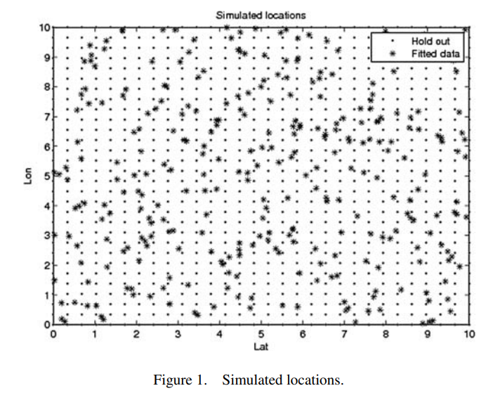

#### September 16, 2020

- **Paper**: [ClimAlign: Unsupervised statistical downscaling of climate variables via normalizing flows](https://arxiv.org/abs/2008.04679)

- **Authors**: [Brian Groenke](https://sites.google.com/view/bgroenke/about), [Luke Madaus](https://twitter.com/lmadaus) and [Claire Monteleoni](https://www.colorado.edu/faculty/claire-monteleoni/)

- **Presenter**: [Jev Gamper](https://mobile.twitter.com/brutforcimag)

  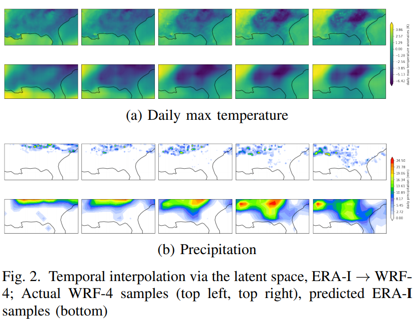

#### September 8, 2020

- **Paper**: [Use of climate information for decision making and impacts research: state of our understanding](https://www.serdp-estcp.org/Program-Areas/Resource-Conservation-and-Resiliency/Infrastructure-Resiliency/Use-of-Climate-Information-for-Decision-Making-and-Impacts-Research-State-of-our-Understanding)

- **Authors**: [Rao Kotamarthi](https://www.anl.gov/profile/rao-kotamarthi), [Linda Mearns](https://staff.ucar.edu/users/lindam), [Kartherine Hayhoe](http://www.katharinehayhoe.com/wp2016/), [Christopher L. Castro](https://has.arizona.edu/people/christopher-l-castro) and [Donald Wuebbles](https://cgs.illinois.edu/people/donald-wuebbles/)

- **Presenter**: [Laura P. Zamboni](https://twitter.com/LauraZamboni6)

  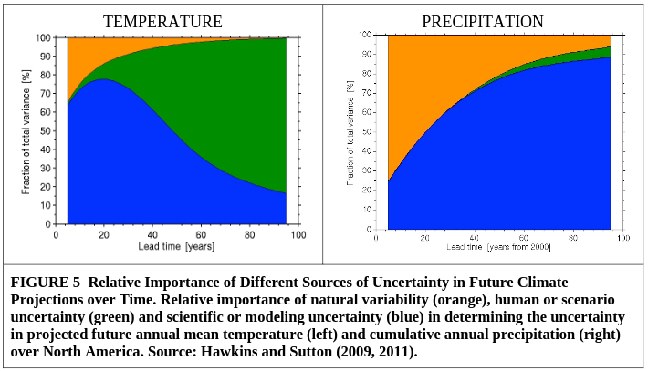

#### July 17, 2020

- **Paper**: [The increasing likelihood of temperatures above 30 to 40 °C in the United Kingdom](https://www.nature.com/articles/s41467-020-16834-0)

- **Authors**: [Nikolas Christidis](https://research.google/people/author58038/), [Mark McCarthy](https://twitter.com/markpmcc?lang=en) and [Peter Stott](https://twitter.com/stottpeter?lang=en)

- **Presenter**: [Owen van Eer](https://mobile.twitter.com/owenvaneer)

  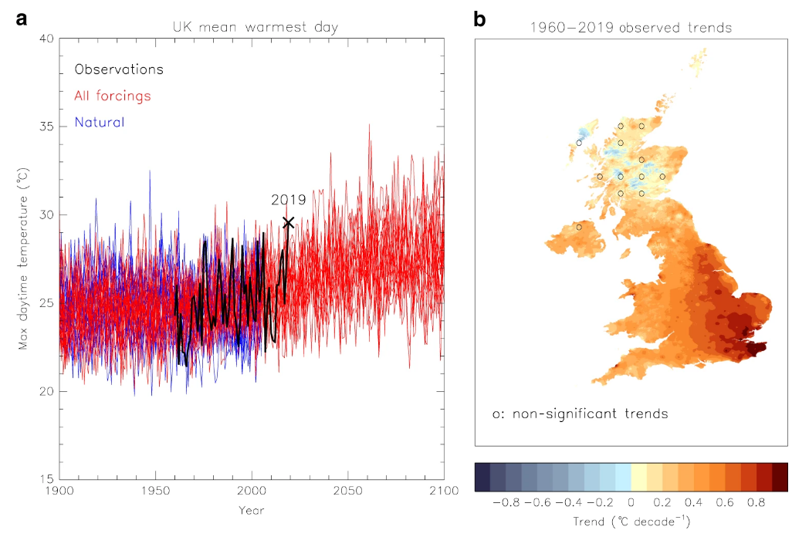

#### May 15, 2020

- **Paper**: [Inundation Modeling in Data Scarce Regions](https://arxiv.org/abs/1910.05006)

- **Authors**: [Zvika Ben-Haim](https://research.google/people/author58038/), Vladimir Anisimov, Aaron Yonas, [Varun Gulshan](https://research.google/people/105170/), Yusef Shaf, [Stephan Hoyer](http://stephanhoyer.com/), and [Sella Nevo](https://research.google/people/SellaNevo/)

- **Presenter**: [Maxim Chernetskiy](https://uk.linkedin.com/in/maxim-chernetskiy)

  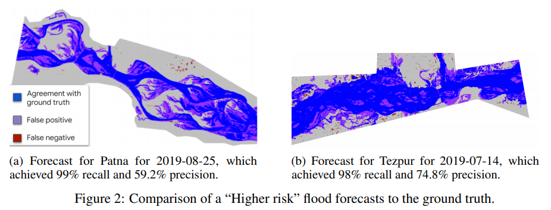

#### May 11, 2020

- **Paper**: [A framework for global river flood risk assessments](https://research.vu.nl/ws/portalfiles/portal/791855/306574.pdf)

- **Authors**: [H. C. Winsemius](https://www.tudelft.nl/en/ceg/about-faculty/departments/watermanagement/staff/staff-hydrology/academic-staff/dr-hessel-winsemius/), [L. P. H. Van Beek](https://www.uu.nl/staff/LPHvanBeek), [B. Jongman](https://scholar.google.nl/citations?user=ww2AjtrbmvQC&hl=en), [P. J. Ward](https://research.vu.nl/en/persons/philip-ward), and [A. Bouwman](https://www.semanticscholar.org/author/A.-F.-Bouwman/143734925)

- **Presenter**: [Owen van Eer](https://twitter.com/owenvaneer)

  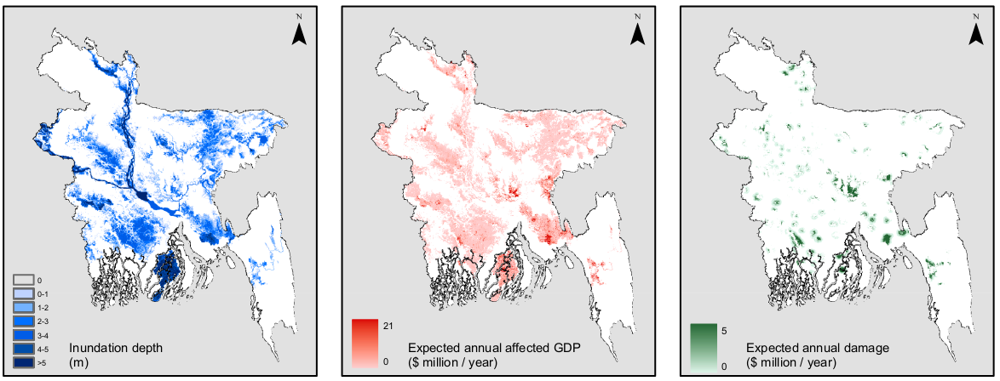

#### March 25, 2020

- **Paper**: [The Potential Predictability of Fire Danger Provided by Numerical
  Weather Prediction](https://journals.ametsoc.org/doi/pdf/10.1175/JAMC-D-15-0297.1)

- **Authors**: [Francesca DI GIUSEPPE](), [Florian Pappenberger](), [Fredrik Wetterhall](), [Blazej Krzeminski](), 
  [Andrea Camia](), [Giorgio Libertá](), [Jesus San Miguel]()

- **Presenter**: [Ramani Lachyan](https://ch.linkedin.com/in/ramani-lachyan-77982918a)

  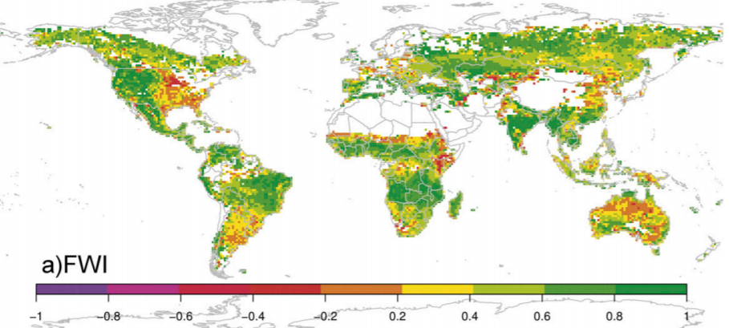

#### March 23, 2020

- **Paper**: [Causal Bayesian Optimisation]()
- **Authors**: [Virginia Aglietti](https://mobile.twitter.com/VGAglietti), [Xiaoyu Lu](https://xiaoyulu2014.github.io/), [Andrei Paleyes](), [Javier Gonzalez](https://twitter.com/javiergonzh)
- **Presenter**: [Virginia Aglietti](https://mobile.twitter.com/VGAglietti)

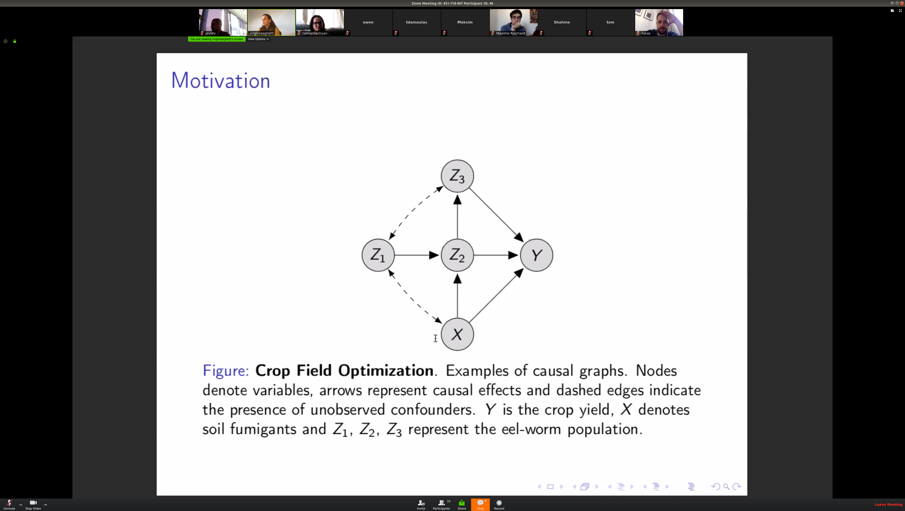

#### March 20, 2020
- **Paper**: [A Review of the Applications of Remote Sensing in Fire Ecology](https://www.mdpi.com/2072-4292/11/22/2638/htm)
- **Authors**: [David M. Szpakowski](), [Jennifer L. R. Jensen]()
- **Presenter**: [Maxim Chernetskiy](https://uk.linkedin.com/in/maxim-chernetskiy)

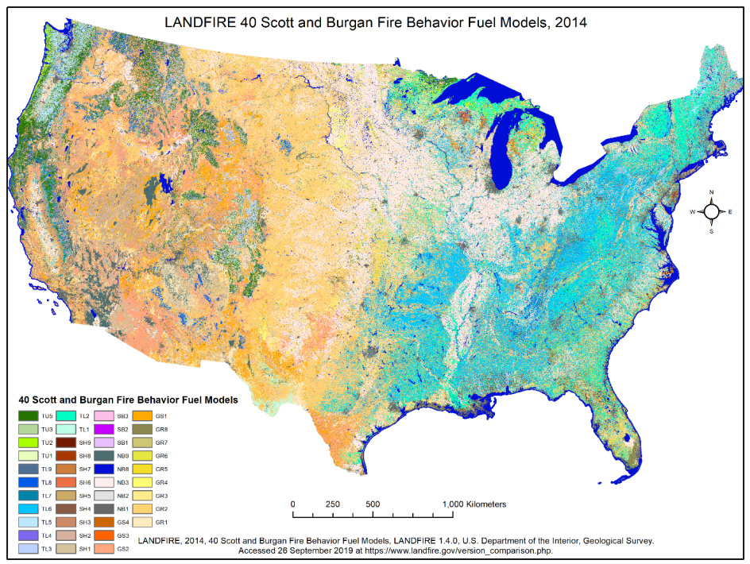

#### March 16, 2020
- **Paper**: [Efficient multiclass ROC approximation by decompoistion via confusion matrix pertrubation analysis](https://www.researchgate.net/profile/Robert_Duin/publication/5483785_Efficient_Multiclass_ROC_Approximation_by_Decomposition_via_Confusion_Matrix_Perturbation_Analysis/links/55b0f2fd08ae092e964fbb32.pdf)
- **Authors**: [Thomas C. W. Landgrebe](), [Robert P. W. Duin]()
- **Presenter**: [Jev Gamper](https://mobile.twitter.com/brutforcimag)

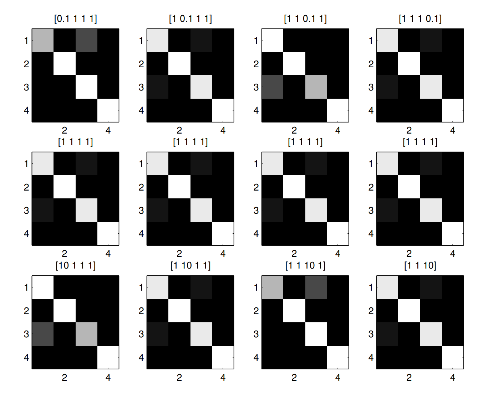

#### January 23, 2020
- **Paper**: [Towards a continuous approach of functional-structural plant growth](https://hal.archives-ouvertes.fr/hal-00529351/document)
- **Authors**: Zhongping Li. et al
- **Presenter**: [Maud Lemercier](https://www.turing.ac.uk/people/researchers/maud-lemercier)

#### January 3, 2020
- **Paper**: [25 years of the WOFOST cropping systems model](https://www.sciencedirect.com/science/article/pii/S0308521X17310107?via%3Dihub)
- **Authors**: [de Wit](https://www.wur.nl/en/Persons/Allard-dr.-AJW-Allard-de-Wit.htm), et al.
- **Presenters**: [Ramani Lachyan](https://www.linkedin.com/in/ramani-lachyan-77982918a/), [Lukas Scholtes](https://www.linkedin.com/in/lukas-scholtes-ab40a4138/)

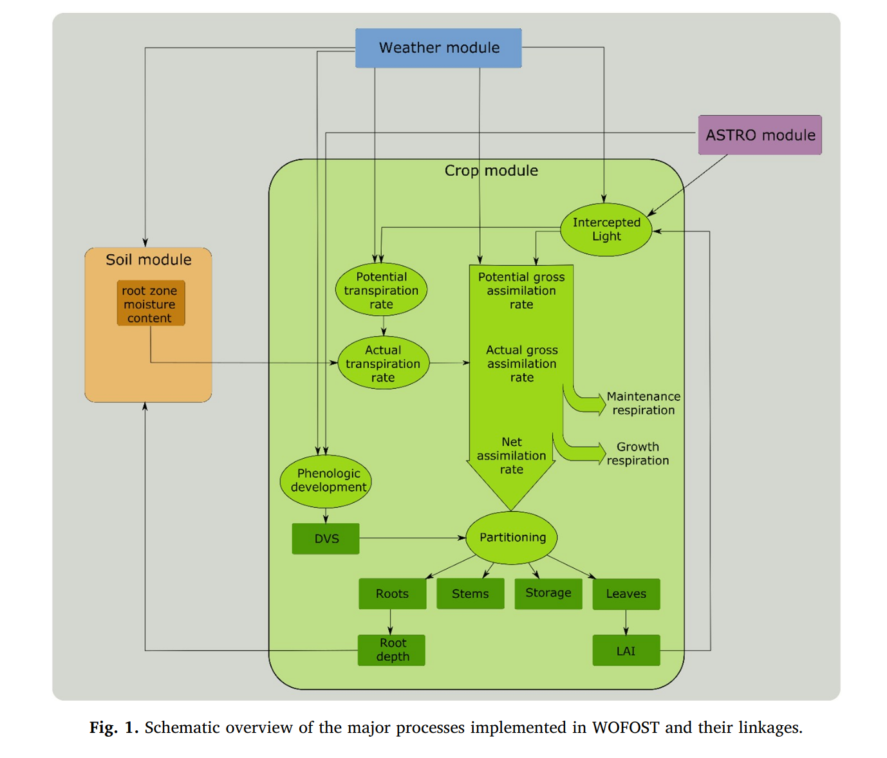

#### November 26, 2019
- **Paper**: [Challenges and design choices for global weather and climate models based on machine learning](https://www.geosci-model-dev.net/11/3999/2018/)
- **Authors**: [Peter D. Dueben](https://www.ecmwf.int/en/about/who-we-are/staff-profiles/peter-dueben), [Peter Bauer](https://www.ecmwf.int/en/about/who-we-are/staff-profiles/peter-bauer)
- **Presenter**: [Jev Gamper](https://mobile.twitter.com/brutforcimag)

#### November 6, 2019
- **Paper**: [DiffEqFlux.jl - A Julia Library for Neural Differential Equations](https://arxiv.org/abs/1902.02376)
- **Authors**: [Chris Rackauckas](https://twitter.com/chrisrackauckas?lang=en), [Mike Innes](https://twitter.com/mikejinnes?lang=en), [Yingbo Ma](), [Jesse Bettencourt](), [Lyndon White](), [Vaibhav Dixit]()
- **Presenter**: [Maxime Rischard](https://uk.linkedin.com/in/maxime-rischard-5229607b)

#### October 25, 2019
- **Paper**: [MCYFS Forecasting Methodology](https://marswiki.jrc.ec.europa.eu/agri4castwiki/index.php/Forecasting_methods), [Performance of the MARS-crop yield forecasting system for the EuropeanUnion: Assessing accuracy, in-season, and year-to-year improvements from1993 to 2015](https://www.sciencedirect.com/science/article/pii/S0308521X18300179)
- **Authors**: [Marijn Van Der Velde](https://twitter.com/marijnvdv78?lang=en), [Luigi Nisini](https://www.linkedin.com/in/luigi-nisini-4629098/)
- **Presenters**: [Ramani Lachyan](https://www.linkedin.com/in/ramani-lachyan-77982918a/), [Lukas Scholtes](https://www.linkedin.com/in/lukas-scholtes-ab40a4138/)

#### October 14, 2019
- **Paper**: [FORCE—Landsat + Sentinel-2 Analysis Ready Data and Beyond](https://www.mdpi.com/2072-4292/11/9/1124/pdf)
- **Autors**: [David Frantz](https://www.geographie.hu-berlin.de/en/professorships/eol/people/labmembers/david_frantz)
- **Presenters**: Micheal Griffiths

#### October 3, 2019
- **Paper**: [The Ethics of AI Ethics](https://arxiv.org/pdf/1903.03425.pdf)
- **Authors**: [Thilo Hagendorff](https://uni-tuebingen.de/einrichtungen/zentrale-einrichtungen/internationales-zentrum-fuer-ethik-in-den-wissenschaften/team/dr-thilo-hagendorff/)
- **Presenter**: [Agnes Schim van der Loeff](https://mobile.twitter.com/AgnesSchim)

#### September 16, 2019

- **Paper**: [Unpaired Image-to-Image Translation using Cycle-Consistent Adversarial Networks](https://arxiv.org/abs/1703.10593)
- **Authors**: [Jun-Yan Zhu](https://arxiv.org/search/cs?searchtype=author&query=Zhu%2C+J), [Taesung Park](https://arxiv.org/search/cs?searchtype=author&query=Park%2C+T), [Phillip Isola](https://arxiv.org/search/cs?searchtype=author&query=Isola%2C+P), [Alexei A. Efros](https://arxiv.org/search/cs?searchtype=author&query=Efros%2C+A+A)
- **Presenter**: [Michael Zotov](https://www.linkedin.com/in/michael-zotov-64b184187/)

#### September 2, 2019

- **Paper**: [Image masking for crop yield forecasting using AVHRR NDVI time series imagery](https://www.sciencedirect.com/science/article/abs/pii/S0034425705003056)
- **Authors**: [Jude H. Kastens](https://biosurvey.ku.edu/directory/jude-kastens), [Terry L. Kastens](https://www.ageconomics.k-state.edu/directory/emeritus_faculty/kastens/index.html), [Dietrich L.A. Kastens](https://twitter.com/dietrichkastens?lang=en), [Kevin P. Prince](https://www.mendeley.com/authors/7201789575/), [Edward A. Martinko](https://eeb.ku.edu/edward-martinko), [Re-Yang Lee](https://www.mendeley.com/authors/7408199876/)
- **Presenter**: [Owen van Eer](https://twitter.com/owenvaneer)

#### August 12, 2019

- **Paper**: [Improving Subseasonal Forecasting in the Western U.S. with Machine Learning](https://arxiv.org/abs/1809.07394)
- **Authors**: [Jessica Hwang](), [Paulo Orenstein](http://stanford.edu/~pauloo/), [Judah Cohen](http://www.judahcohen.org/), [Karl Pfeiffer](), [Lester Mackey](https://web.stanford.edu/~lmackey/)
- **Presenter**: [Jev Gamper](https://mobile.twitter.com/brutforcimag)

