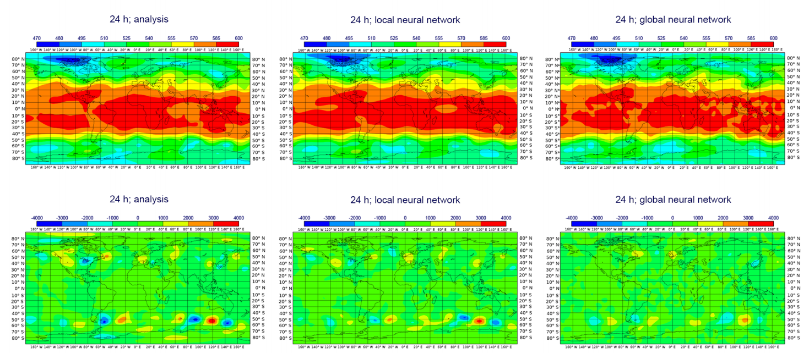

# Legere coetus chartam

Translated from Latin as _read the paper group_. On a weekly basis our science team reads and reviews anything from [_Challenges
design choices for global weather and climate models based on machine learning_](https://www.geosci-model-dev.net/11/3999/2018/)
to [DiffEqFlux.jl - A Julia Library for Neural Differential Equations
.](https://arxiv.org/abs/1902.02376) See planned [future discussions](https://github.com/Cervest/legere-coetus-chartam#planned-discussions) below.

#### January 23, 2020
- **Paper**: [Towards a continuous approach of functional-structural plant growth](https://hal.archives-ouvertes.fr/hal-00529351/document)
- **Authors**: [Zhongping Li. et al]
- **Presenter**: [Maud Lemercier]

#### November 26, 2019
- **Paper**: [Challenges and design choices for global weather and climate models based on machine learning](https://www.geosci-model-dev.net/11/3999/2018/)
- **Authors**: [Peter D. Dueben](https://www.ecmwf.int/en/about/who-we-are/staff-profiles/peter-dueben), [Peter Bauer](https://www.ecmwf.int/en/about/who-we-are/staff-profiles/peter-bauer)
- **Presenter**: [Jev Gamper](https://mobile.twitter.com/brutforcimag)

#### November 6, 2019
- **Paper**: [DiffEqFlux.jl - A Julia Library for Neural Differential Equations](https://arxiv.org/abs/1902.02376)
- **Authors**: [Chris Rackauckas](https://twitter.com/chrisrackauckas?lang=en), [Mike Innes](https://twitter.com/mikejinnes?lang=en), [Yingbo Ma](), [Jesse Bettencourt](), [Lyndon White](), [Vaibhav Dixit]()
- **Presenter**: [Maxime Rischard](https://uk.linkedin.com/in/maxime-rischard-5229607b)

#### October 25, 2019
- **Paper**: [MCYFS Forecasting Methodology](https://marswiki.jrc.ec.europa.eu/agri4castwiki/index.php/Forecasting_methods), [Performance of the MARS-crop yield forecasting system for the EuropeanUnion: Assessing accuracy, in-season, and year-to-year improvements from1993 to 2015](https://www.sciencedirect.com/science/article/pii/S0308521X18300179)
- **Authors**: [Marijn Van Der Velde](https://twitter.com/marijnvdv78?lang=en), [Luigi Nisini](https://www.linkedin.com/in/luigi-nisini-4629098/)
- **Presenters**: [Ramani Lachyan](https://www.linkedin.com/in/ramani-lachyan-77982918a/), [Lukas Scholtes](https://www.linkedin.com/in/lukas-scholtes-ab40a4138/)

#### October 14, 2019
- **Paper**: [FORCE—Landsat + Sentinel-2 Analysis Ready Data and Beyond] (https://www.mdpi.com/2072-4292/11/9/1124/pdf)
- **Autors**: [David Frantz](https://www.geographie.hu-berlin.de/en/professorships/eol/people/labmembers/david_frantz)
- **Presenters**: Micheal Griffiths

#### October 3, 2019
- **Paper**: [The Ethics of AI Ethics](https://arxiv.org/pdf/1903.03425.pdf)
- **Authors**: [Thilo Hagendorff](https://uni-tuebingen.de/einrichtungen/zentrale-einrichtungen/internationales-zentrum-fuer-ethik-in-den-wissenschaften/team/dr-thilo-hagendorff/)
- **Presenter**: [Agnes Schim van der Loeff](https://mobile.twitter.com/AgnesSchim)

#### September 16, 2019

- **Paper**: [Unpaired Image-to-Image Translation using Cycle-Consistent Adversarial Networks](https://arxiv.org/abs/1703.10593)
- **Authors**: [Jun-Yan Zhu](https://arxiv.org/search/cs?searchtype=author&query=Zhu%2C+J), [Taesung Park](https://arxiv.org/search/cs?searchtype=author&query=Park%2C+T), [Phillip Isola](https://arxiv.org/search/cs?searchtype=author&query=Isola%2C+P), [Alexei A. Efros](https://arxiv.org/search/cs?searchtype=author&query=Efros%2C+A+A)
- **Presenter**: [Michael Zotov](https://www.linkedin.com/in/michael-zotov-64b184187/)

#### September 2, 2019

- **Paper**: [Image masking for crop yield forecasting using AVHRR NDVI time series imagery](https://www.sciencedirect.com/science/article/abs/pii/S0034425705003056)
- **Authors**: [Jude H. Kastens](https://biosurvey.ku.edu/directory/jude-kastens), [Terry L. Kastens](https://www.ageconomics.k-state.edu/directory/emeritus_faculty/kastens/index.html), [Dietrich L.A. Kastens](https://twitter.com/dietrichkastens?lang=en), [Kevin P. Prince](https://www.mendeley.com/authors/7201789575/), [Edward A. Martinko](https://eeb.ku.edu/edward-martinko), [Re-Yang Lee](https://www.mendeley.com/authors/7408199876/)
- **Presenter**: [Owen van Eer](https://www.linkedin.com/in/owen-van-eer-562816147/)

#### August 12, 2019

- **Paper**: [Improving Subseasonal Forecasting in the Western U.S. with Machine Learning](https://arxiv.org/abs/1809.07394)
- **Authors**: [Jessica Hwang](), [Paulo Orenstein](http://stanford.edu/~pauloo/), [Judah Cohen](http://www.judahcohen.org/), [Karl Pfeiffer](), [Lester Mackey](https://web.stanford.edu/~lmackey/)
- **Presenter**: [Jev Gamper](https://mobile.twitter.com/brutforcimag)

### Planned Discussions

#### March 16, 2020
- **Paper**: [Efficient multiclass ROC approximation by decompoistion via confusion matrix pertrubation analysis](https://www.researchgate.net/profile/Robert_Duin/publication/5483785_Efficient_Multiclass_ROC_Approximation_by_Decomposition_via_Confusion_Matrix_Perturbation_Analysis/links/55b0f2fd08ae092e964fbb32.pdf)
- **Authors**: [Thomas C. W. Landgrebe](), [Robert P. W. Duin]()
- **Presenter**: [Jev Gamper](https://mobile.twitter.com/brutforcimag)

#### March 20, 2020
- **Paper**: [A Review of the Applications of Remote Sensing in Fire Ecology](https://www.mdpi.com/2072-4292/11/22/2638/htm)
- **Authors**: [David M. Szpakowski](), [Jennifer L. R. Jensen]()
- **Presenter**: [Maxim Chernetskiy](https://uk.linkedin.com/in/maxim-chernetskiy)

#### March 25, 2020
- **Paper**: [The Potential Predictability of Fire Danger Provided by Numerical
Weather Prediction](https://journals.ametsoc.org/doi/pdf/10.1175/JAMC-D-15-0297.1)
- **Authors**: [Francesca DI GIUSEPPE](), [Florian Pappenberger](), [Fredrik Wetterhall](), [Blazej Krzeminski](), 
[Andrea Camia](), [Giorgio Libertá](), [Jesus San Miguel]()
- **Presenter**: [Ramani Lachyan](https://ch.linkedin.com/in/ramani-lachyan-77982918a)
